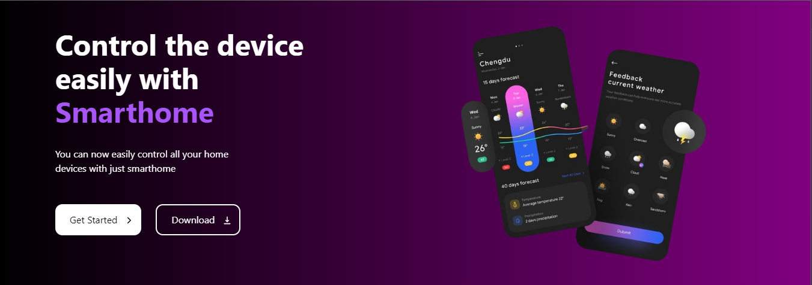

# front-end-task




### Table of Contents

- [Introduction](#introduction)
- [Usage](#usage)

## Design
### Hero Section
The hero section is a crucial part of the landing page, as it is the first thing users see when they visit the website. The design choices for the hero section were made to create an engaging and visually appealing introduction to the site.

#### Design Choices
- **Background Colour and image:** A high-quality image and background gradient colour was chosen to create an immersive experience. This image and colours represents the core theme of the project and immediately sets the tone for the user.
- **Responsive Design:** The hero section is designed to be fully responsive, ensuring it looks great on all devices, from desktops to mobile phones. Media queries and flexible layout techniques were used to achieve this.

#### Rationale for Design Choices
- **Clarity:** Central alignment of the headline and subheadline ensures the message is conveyed clearly without distractions.
- **Accessibility:** Responsive design ensures that all users, regardless of their device, have a seamless and consistent experience.

## Installation
Follow these steps to clone and run the project locally.

### Prerequisites
Ensure you have the following installed:
- [Node.js](https://nodejs.org/) (which includes npm)
- [Git](https://git-scm.com/)

### Steps
1. **Clone the repository:**
   ```bash
   
   git clone https://github.com/Hansajaa/front-end-task.git

2. **Navigate to the project directory:**
    ```bash
    cd front-end-task
    
3. **Install dependencies:**
    ```bash
    npm i
    
4. **Run the development server:**
   ```bash
   npm run dev
   
5. **Open your browser and visit:**
   ```bash
   http://localhost:5173


